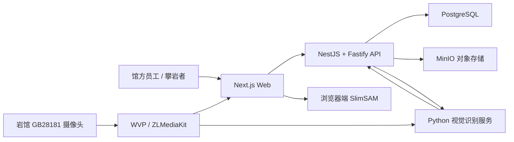

# Climbing 数字化运营平台 POC

面向攀岩馆的多租户 SaaS POC，贯通岩点资产、线路视觉建档、摄像头识别、录像复核和线路反馈。系统只展示数据库中的真实业务数据，不使用前端写死的演示统计。

当前目标是验证单馆低并发场景中的业务闭环和工程边界，不等同于已经完成生产化的通用攀岩识别产品。RFID 批量盘点和跨馆流转已保留领域模型与接口，动态公网 IP 自动白名单仍在隔离实验分支中，均不应描述为已验收功能。

## 核心能力

- 邮箱注册、登录、HTTP-only Session、`L1_ADMIN` / `L2_ADMIN` 权限和组织级租户隔离。
- 岩点规格、照片、GLB 模型、库存余额与不可变流水的增删改查。
- 登录后的 AI 辅助定线模块：独立单点岩点库、自由墙/固定板/天宇训练板、人工调点和三条候选线路。
- RFID 标签、单件追踪、盘点会话和跨馆流转领域接口。
- 通过摄像头截图和浏览器端 SlimSAM 标注岩点轮廓，设置线路起点、终点并创建线路版本。
- 线路查询、编辑、停用、恢复、删除、二维码反馈和单线路复盘。
- Python 视觉服务读取已发布线路定义，识别攀爬尝试并幂等写入结果。
- 识别历史搜索、筛选、短期录像证据和不可变人工复核；录像状态可区分历史未留存、处理中、可播放、上传失败与已过期。
- 人体完整性、无人墙面前景、低照度和正式起步多层门控，拒绝空画面误报进入业务统计。

## 系统架构



关键边界：

- 浏览器不提交可信的组织 ID 或角色；业务范围由服务端 Session 推导。
- PostgreSQL 保存结构化事实，图片、GLB 和录像保存在 MinIO。
- SlimSAM 只生成待用户确认的轮廓，不直接创造线路业务真值。
- 视觉服务只读取已发布且未停用的线路，不按颜色或名称猜测线路 ID。
- 算法评分是规则证据评分，不是经过真实样本校准的统计正确率；人工复核与算法原判分别保存。

## 技术栈

| 层级 | 技术                                                            |
| ---- | --------------------------------------------------------------- |
| Web  | Next.js 15、React 19、TypeScript、Three.js、`model-viewer`      |
| API  | NestJS 11、Fastify 5、Zod、Swagger                              |
| 数据 | PostgreSQL 17、Prisma 6、MinIO                                  |
| 视觉 | Python、OpenCV、Ultralytics YOLO Pose、PyTorch、SlimSAM         |
| 工程 | pnpm 11、Turborepo、Vitest、ESLint、Prettier、Docker Compose    |
| 生产 | Azure Ubuntu VM、Caddy、WVP/ZLMediaKit、独立视觉 Worker Compose |

## 仓库结构

```text
apps/web/                 Web 页面和浏览器端视觉交互
apps/api/                 API、权限、领域服务和 Prisma schema
apps/api/prisma/          数据库迁移
packages/config/          共享 TypeScript 配置
services/vision-worker/   实时视频切片、姿态分析和识别安全门控
infra/                    本地/生产 Compose 与部署脚本
docs/                     领域规格、部署、算法和交接文档
```

## 本地部署

### 1. 前置条件

- Node.js `22.23.x`
- pnpm `11.9.0`
- Docker Desktop / Docker Compose
- 运行视觉 Worker 时另需 Python 3.11 或 3.12、FFmpeg，以及可访问的 HTTP(S)-FLV 摄像头地址

### 2. 配置环境

```bash
git clone https://github.com/webanaiservice/climbingAI.git
cd climbingAI
cp .env.example .env
```

在 `.env` 中替换 PostgreSQL、MinIO 和 Worker 占位值。不要提交 `.env`、生产密钥、数据库备份、录像或 SSH 私钥。

使用云端 AI 定线时，还需仅在 API 服务端的 `.env` 或部署平台私密环境变量中设置 `DEROUTER_API_KEY`。可按需覆盖 `DEROUTER_OPENAI_BASE` 和 `DEROUTER_ANTHROPIC_BASE`；不要设置为 `NEXT_PUBLIC_*`，也不要把密钥写进 Web 配置或提交到仓库。未配置密钥时，定线模块会提示并使用本地约束求解器。

### 3. 安装并启动 Web/API

```bash
corepack enable
pnpm install --frozen-lockfile
pnpm services:up
pnpm db:generate
pnpm db:migrate
pnpm dev
```

本地入口：

- Web：<http://localhost:3100>
- API：<http://localhost:3101/api>
- AI 定线：登录后进入 <http://localhost:3100/dashboard/route-setting>
- Swagger：<http://localhost:3101/api/docs>
- PostgreSQL：`localhost:5434`
- MinIO Console：<http://localhost:9003>

本地 Compose 还预留 Redis `localhost:6380`，当前核心业务不依赖 Redis。Web 开发和生产构建分别使用 `.next-dev` 与 `.next-build`，运行 `pnpm dev` 时可以安全执行构建验证。

### 4. 启动本地视觉服务

先在 `.env` 配置与本地 API 一致的 `CAMERA_WORKER_TOKEN`、本地组织的 `CAMERA_WORKER_ORGANIZATION_ID` 和开发机可访问的 `CAMERA_RESOURCE_URL`：

```bash
pnpm worker:setup
pnpm worker:probe
pnpm worker:start
```

另一个终端可查看心跳：

```bash
pnpm worker:status
```

本地 Worker 与 Azure Worker 完全独立。它必须从本地 API 读取到至少一条已发布的摄像头线路定义；输出默认保存在被 Git 忽略的 `tmp/vision-worker`。

修改 Worker 时可以先执行 `pnpm worker:stop`。本地开发结束前必须执行 `pnpm worker:restore`：该命令会停止旧进程，用当前工作区代码重新启动 Worker，并等待最新心跳通过；随后再以 `pnpm worker:status` 复核。前台调试仍可使用 `pnpm worker:dev`，但关闭终端会同时停止该进程。

## 验证

提交或部署前执行：

```bash
pnpm lint
pnpm typecheck
pnpm test
pnpm worker:test
pnpm build
pnpm --filter @climbing-crm/api db:check
pnpm --filter @climbing-crm/api exec prisma migrate status
```

默认测试不会连接正式数据库；数据库硬化集成测试需要显式设置 `DATABASE_INTEGRATION=true`。

## 生产部署与版本边界

开发顺序固定为：

```text
本地 feature/fix 分支 → 本地验证 → 本地 main → Azure 人工发布与验收 → GitHub 同步/Release
```

Azure 是唯一演示环境，当前不启用自动 CD。发布必须先备份 PostgreSQL，再运行 `prisma migrate deploy`，最后验证 Web、API、WVP、媒体流和视觉服务。详见 [Azure 虚拟机部署说明](docs/Azure虚拟机部署说明.md) 和 [Git 仓库与 CI 策略](docs/Git仓库与CI策略.md)。

## 文档入口

- [当前状态与后续开发交接](docs/POC当前状态与后续开发交接文档.md)
- [2026-09-16 登录入口优化发布记录](docs/发布记录-2026-09-16.md)
- [2026-09-15 正式发布记录](docs/发布记录-2026-09-15.md)
- [2026-09-11 正式发布记录](docs/发布记录-2026-09-11.md)
- [Azure 虚拟机部署说明](docs/Azure虚拟机部署说明.md)
- [摄像头实时视频与攀爬识别 POC](docs/摄像头实时视频与攀爬识别POC.md)
- [识别历史与人工复核设计](docs/摄像头识别历史与人工复核设计.md)
- [视觉 Worker 运行说明](services/vision-worker/README.md)
- [岩点模块设计与全栈实现详解](docs/岩点模块设计与全栈实现详解.md)
- [实地考察与演示确认清单](docs/岩馆实地考察与POC演示确认清单.md)

## 已知边界

- AI 定线模块沿用原 POC 的单点产品目录和天宇板视觉点位，固定板编辑存于当前浏览器 `localStorage`；它尚未与平台数据库中的岩点库存、墙孔安装记录或线路版本自动同步。切换域名/端口或浏览器不会自动迁移已有本机存档。
- AI 候选是人工审核草案，不能直接发布为平台正式线路或代替现场试爬、落地区域与安装安全检查。生成接口要求登录和定线权限，并按账号限流 12 次/小时。

- 单摄像头 POC 暂不支持多人同时攀爬、多机位三维接触确认或通用赛事判罚。
- 摄像头 PTZ、变焦、分辨率、安装位置或墙面发生变化后，必须重新建立无人墙面参考并复核线路视觉定义。
- 识别精度仍需通过真实正负样本集量化；低质量画面会暂停识别，而不是生成猜测记录。
- 岩馆动态公网 IP 变化目前仍需人工更新 Azure NSG；自动白名单实验没有合入 `main`。
- RFID 批量硬件接入和跨馆租借业务流程仍待后续阶段完成。
