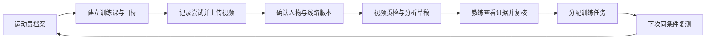

# 速度训练运动员档案与 AI 复盘系统设计

日期：2026-09-25。状态：产品与技术设计草案，尚未实现。

## 1. 定位与首版假设

在现有 climbingAI 岩馆运营平台中新增“运动员训练”模块。围绕星星道、飞鸟道两类固定布局，建立运动员档案、训练课、逐次尝试、视频证据、教练复核与训练验证的完整关联。

首版按单馆、教练主用、手机视频上传、两类固定赛道设计；数据结构保留现有多组织隔离。家长先查看经教练确认的报告，后续再扩展家长上传、固定摄像头和计时设备直连。

核心问题是：这次哪里发生了变化、证据是什么、下次练什么、怎样验证效果。固定线路使同位置比较更可行，但不代表所有身高和训练阶段都应采用唯一手脚顺序。

线路标准应保存发布机构、版本、安装图和馆内实际安装记录。公开体育总局材料将“加点版国际标准速度赛道”与“星星赛道”分列，尚不能仅凭俗称确认两类都属于同一国际标准。飞鸟道具体标准与版本待以馆方安装图核实。这不阻碍先按两类固定模板设计。

## 2. 可参考的其他运动产品

以下为官方产品资料的功能归纳，不代表已试用或独立验证其准确性。

| 产品 | 官方能力 | 本项目借鉴 | 迁移边界 |
| --- | --- | --- | --- |
| Onform | 视频慢放、并排与叠加比较、标注、语音反馈、运动员工作空间 | 教练围绕具体视频片段给反馈，形成运动员视频档案 | 其专项 AI 功能不等于已经支持攀岩自动诊断 |
| Dartfish | 多视角、视频比较、动作叠加、外部数据整合 | 同一动作节点对齐，比较两次表现；后续整合计时器 | 首版无需复制其所有专业工具 |
| SwingVision | 网球/匹克球视频分析、专项追踪与统计、团队查看运动员数据 | 固定场地模型、自动切片、视频与统计联动 | 网球识别模型不能直接用于攀岩 |
| TrainingPeaks | 训练日历、计划执行、运动员历史、教练反馈 | 训练前计划—训练后记录—调整—复测 | 不直接移植耐力运动的 TSS、CTL 等指标到儿童速度攀岩 |
| Sportsbox AI | 高尔夫动作模型、量化指标与个性化反馈 | 专项动作阶段与指标词典，先有证据再给解释 | 高尔夫单机位三维能力不证明攀岩也具备相同精度 |

来源：

- Onform 工具：https://support.onform.com/article/116-analysis-tools
- Onform 教练工作流：https://support.onform.com/article/153-user-guide-onform-video-analysis-app
- Dartfish：https://www.dartfish.com/pro/
- SwingVision 团队：https://swing.vision/teams
- TrainingPeaks：https://www.trainingpeaks.com/blog/trainingpeaks-guide-for-coaches/
- Sportsbox：https://www.sportsbox.ai/
- Sportsbox 自述验证方法：https://help.sportsbox.ai/sportsbox-ai-accuracy
- 体育总局场地文件：https://www.sport.gov.cn/dszx/n5414/c24389525/part/24389535.pdf
- World Climbing 器材规范入口：https://www1.ifsc-climbing.org/resources/sport-equipment

## 3. 用户流程

教练的日常操作：打开当天训练课，选运动员、线路/赛道与训练类型，上传视频并确认画面中的目标人物。系统补充候选起止点与结果；教练修正不确定项后得到带时间戳的复盘。所有尝试可以记成绩，只有选定视频进入深度分析，避免每次都等待长报告。

一次上传可能含多次尝试或多位运动员；媒体文件与尝试不是一对一关系。多个机位也可关联同一次尝试。首版允许人工切片、选择目标与赛道，避免自动认错人。训练中的短段练习和完整计时尝试必须分开统计。

## 4. 五个主要页面

### 4.1 运动员列表与档案

列表只突出近期状态、待复核视频、当前训练重点和下一次复测。档案包含基本信息、所属教练/班组、监护人关联、开始训练日期、目标、测量历史、成绩、训练记录和视频。

身高、体重、臂展及体能测试都按测量日期保留历史，不覆盖成单个“当前值”。旧视频关联拍摄时有效的测量记录，缺失时显示未知。体能测试记录项目、方法、单位、器材、次数及教练备注，方法不同的测试不直接混成趋势。

### 4.2 训练日历与训练课

记录计划内容与实际执行：技术、速度、基础体能等项目；到馆总时长、有效练习时长（可选）、全程/分段次数、休息、主观疲劳、疼痛与教练备注。分清全力计时、可控速度技术练习、比赛和热身。

首版不自动判断“8 小时是否超量”，也不从低分推导必须加强某肌群。先支持稳定记录与教练解释。

### 4.3 视频复盘工作台

- 左侧：原速、慢放、逐帧、事件跳转、目标人物标识。
- 右侧：AI 观察、解释假设、证据质量、教练修订及训练建议。
- 下方：起步、分段、停滞、失误、终点时间轴。
- 对照区：本次与选定的个人历史成功视频并排。
- 两种对照模式：真实时间同步用于比较快慢；动作节点同步用于比较动作。动作对齐不能改写原始耗时。

人物骨架默认可关闭；关键问题应直接定位到片段，避免只有骨架和总评分却看不出要改什么。

### 4.4 训练任务

每项任务绑定发现的问题和证据，写清动作目标、教练决定的练习方式/剂量、适用条件、复测时间和判定标准。状态包括待安排、已执行、待复测、改善、未改善、证据不足。

### 4.5 进步报告

按同一线路版本、全程/分段类型和可比训练条件显示最佳有效成绩、有效完攀中位数、完成率、样本数、关键段耗时和当前任务结果。失败、主动结束、计时异常和看不清分开记录，不能给失败填零秒，也不能只用最快一次描述进步。

家长视图突出本期进步、正在练的动作和下一步目标；默认不展示未经复核的身体能力推断。

## 5. 固定赛道数据模型

采用“标准模板 → 馆内安装版本 → 实际赛道 → 摄像机标定”的层次。

模板包括标准来源、版本、墙面几何、岩点编号/位置/朝向、起点和终点、允许使用的点位、加点情况、教练定义的分段事件。星星与飞鸟分别管理，不共享成绩基线。

同一模板的左右道保留赛道 ID。更换点位、改变朝向、加脚点、改变终点或墙面几何时创建安装版本。摄像机移动、变焦、裁切或分辨率改变时更新标定版本。旧分析保留当时版本的快照。

手脚序列作为“动作方案”保存，可有多种教练确认版本。以身高、臂展、训练阶段及本人成功记录选择参考，不强迫儿童模仿成人动作。

分段事件需可重复标注，例如指定手首次到达某编号区域；不能用含糊的“爬到一半”。视觉接近岩点只是候选接触，不能当作真实承重证据。

## 6. AI 应输出什么

每条发现包含：观察事实、视频区间、关联岩点/分段、可能解释、证据质量、对照尝试、建议、复测指标、教练结论。

以本次 IMG_6812 为真实示例：

- 事实：约 16–18 秒双手在同一组手点附近，下肢反复调整，向上移动中断，随后脱落。
- 假设：换脚与下一步衔接不稳定；不能确认最初是脚部还是手部接点问题。
- 对照：IMG_6813、IMG_6814 中类似区间的成功动作。
- 建议草稿：由教练拆分相邻动作、确定适合孩子的手脚顺序，再逐渐提高速度。
- 复测：该段通过率、额外调整次数和耗时，并明确统计分母及条件。

证据质量用“充分/有限/不可判定”等标签并解释原因。没有校准前不展示“95% 正确率”。每份报告优先呈现一项已做好的动作和一至两项最值得改进的动作。

### 指标分层

| 层级 | 指标 | 条件 |
| --- | --- | --- |
| 首版可用 | 教练确认的完攀结果、录入的电子计时、视频起止、手工校正的分段、尝试次数 | 保存来源、复核状态及缺失项 |
| 验证后辅助 | 自动分段、停滞候选、手脚顺序、明显离点/摆动、重复调整 | 固定机位、目标明确、专项标注集验证，可人工纠正 |
| 首版不作可靠测量 | 手指受力、真实三维重心、精确关节负荷、肌力不足原因、伤病预测 | 单机位视频缺少直接测量依据 |

官方电子计时、人工录入电子计时、计时屏 OCR 和视频估时分别存储；来源冲突时进入复核。反应时间需要可同步的发令与起动证据；仅从身体第一帧移动起计时应标为运动耗时。30 fps 一帧约 33 毫秒，不把视频估计包装成毫秒级赛事计时。处理可变帧率时使用原始时间戳。

## 7. 技术实现路径

采用视觉分析与语言解释分工的管线：

1. 上传、校验、记录拍摄时间/方向/帧率/文件哈希；生成可播放代理文件，保留源时间戳映射。
2. 视频质检：目标人物大小、全身可见度、遮挡、清晰度、起终点覆盖、是否为剪辑或慢动作。
3. 用户确认人物、实际赛道与线路版本；套用已确认标定。
4. 视觉模块提取候选事件、轨迹与分段；低质量字段留空。
5. 确定性代码计算已确认事件对应的时间和统计；检索可比的历史尝试。
6. 多模态模型结合关键视频片段、测量结果、个人历史、教练知识库，生成结构化建议草稿。
7. 检查每条结论是否有证据引用、是否超出可测范围、是否与成绩来源冲突。
8. 教练确认、修改或拒绝；保留 AI 原稿与修订记录，再进入运动员正式训练记录。

视觉和语言任务异步执行，状态包括排队、预处理、需补充信息、分析中、待复核、已确认、失败。支持幂等、重试、取消和重分析，避免重传或重试制造重复训练次数。

早期不先训练专属大模型。先沉淀事件标注、成功/失误对照、教练修订、适龄训练任务库。模型更新时通过固定回归样本集比较，不能默默改写历史报告。

## 8. 与现有项目的结合

本次检查的集成主体为工作区内 `climbingAI`，不是外层定线演示站。

已确认可以复用的基础：

- Next.js 前端、NestJS API、PostgreSQL/Prisma、MinIO。
- 组织与账号、服务端租户隔离、能力权限和审计。
- `Route`、`RouteVersion`、`WallSegment` 及线路视觉定义。
- Python Vision Worker 的视频处理、姿态候选、质检与人工复核经验。

建议新增独立训练领域，通过关系引用现有线路及观察记录：

| 实体 | 主要责任 |
| --- | --- |
| Athlete / AthleteAccess | 运动员、教练与监护人授权；运动员不必有登录账号 |
| AthleteMeasurement / Assessment | 带日期及测试方法的成长与体能历史 |
| TrainingSession / ExerciseLog | 训练课、计划和实际训练项目 |
| SpeedTemplate / Installation / Calibration | 标准、实际安装、赛道与视频坐标版本 |
| SpeedAttempt | 一次全程或分段尝试、结果、计时来源、所属训练课 |
| TrainingMedia / AttemptMedia | 视频资产、多片段/多机位与尝试的关联 |
| AttemptEvent / SegmentMetric | 带来源及复核状态的事件与分段 |
| AnalysisRun / AnalysisFinding / CoachReview | 模型版本、分析输入、逐条发现及人工修订 |
| TrainingTask / Retest | 问题对应的练习与复测结果 |

具体实体名称与拆分在实施时确定。业务可查询的事实采用结构化字段，姿态序列等大体积数据进入对象存储，不把训练系统全塞入既有 metadata。

三个必须单独处理的边界：

1. 当前普通摄像头证据默认 72 小时过期，训练档案需要独立媒体生命周期。归档后不能仍被原证据清理器删除；缩略图、关键帧、报告和原片一起管理权限及删除。
2. 现有 Worker 的正式起步要求起点稳定、脚支撑、髋部上升与手部推进。它适用于现有识别目标，不应未经验证就用作速度赛发令/反应计时，也不能吞掉训练中的中途短段视频。
3. 当前文档明确单摄像头 POC 尚不支持多人同时攀爬。速度双道分析首版要用人工确认的赛道与目标，独立验证持续跟踪，不能把匿名 climberKey 直接视为运动员身份。

长视频分析使用独立作业队列与离线 Worker，避免阻塞现有实时摄像头进程。可先选数据库作业表或独立队列，按重试、并发与资源需求确定，不必为首版引入复杂服务拆分。

新增训练能力权限：教练查看其负责运动员、复核报告和安排任务；家长只访问关联孩子的授权内容。视频链接需要鉴权及短时有效访问；上传授权、第三方模型处理范围和留存规则纳入运动员建档。不能沿用公开线路二维码分享训练视频。未成年人数据不默认用于训练通用模型。

## 9. 迭代与验证

### 阶段一：教练可用的档案与复盘

两类模板、运动员/测量历史、训练课、逐次尝试、批量上传、人工选人/切片、手工成绩、带证据的 AI 草稿、教练复核、并排比较、任务与复测。分段允许人工确认；家长先通过受控报告查看。

### 阶段二：固定场景自动化

验证自动分段、候选手脚顺序、问题片段自动定位、历史成功样本检索和跨次趋势。根据首版教练最常使用和纠正的字段决定优先级。

### 阶段三：采集与计时设备整合

固定机位、自动切片、训练课签到绑定尝试、电子计时接入。必要时补充同步侧面机位，验证后再增加三维指标。

建议先选择约 5–10 名运动员、两类线路、约 50–100 次尝试开展试点，数量仅用于验证流程，不代表足以训练专用模型或证明通用准确率。数据应包含成功、失误、中途练习、遮挡、无动作、多人和终点疑似未触发等情况。

标注集需要教练确认起止、分段、结果和主要技术问题；争议片段由另一名教练复核。划分评估集时按运动员/训练日期分组，避免相邻尝试泄漏。评估指标分别报告：人物/赛道关联错误、事件时间误差、完攀结果一致性、问题提示的正确与遗漏情况、不可分析比例、教练纠正耗时、单次分析成本和时延。

建议首版流程验收要求：

- 每条已展示的 AI 问题都有可点击的视频证据。
- 模糊画面可明确返回证据不足，手工复盘仍可使用。
- 任何视频或成绩都可追溯至运动员、拍摄日期、实际线路版本和来源。
- 只有教练确认的建议进入正式训练任务。
- 成绩统计展示可比条件、样本数及失败/未知的处理方式。
- 至少完成一次“发现问题—执行练习—复测—教练评价”的真实闭环。

具体误差阈值在教练对分段用途和计时要求达成一致后设定，不在获得测试样本前承诺识别率。产品价值先验证是否节省复盘时间、是否帮助孩子稳定完成目标动作。

## 10. 实施前需要确认的资料

- 两条实际线路的安装图、标准来源/版本、加点与终点设置。
- 首批运动员、负责教练和现有训练记录方式。
- 可用拍摄位置、画面清晰度以及计时器是否能导出数据。
- 教练认可的分段定义、技术问题词典和三至五种常用练习。

本次仅形成设计文档，没有修改应用代码、数据库、摄像头服务或部署配置。
